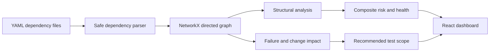

# RIP — Resilient Impact Platform

RIP turns YAML dependency definitions into an interactive architecture map, then deterministically explains how failures and changes propagate. It uses graph analysis—not an LLM or RAG—to calculate blast radius, component risk, potential bottlenecks, cycles, critical paths, test scope, and architecture health.

Technology stack: plain React JavaScript (`.jsx` and `.js`) for the frontend and FastAPI Python for the backend.

For the two-participant explanation, equal contribution plan, workflow diagrams, and demo script, see [TEAM_PRESENTATION_GUIDE.md](TEAM_PRESENTATION_GUIDE.md).

## How it works



An edge `Order Service → Inventory Service` means Order Service depends on Inventory Service. Upstream dependencies are outgoing neighbors. Downstream consumers are incoming neighbors. Failure propagation traverses incoming edges with a cycle-safe breadth-first search; distance 1 is direct impact and greater distances are indirect impact.

The RIP Composite Risk Score is transparent and deterministic: 40% normalized blast radius, 25% affected applications, 20% betweenness centrality, and 15% dependency depth. Potential SPOFs are candidates with high downstream reach and/or articulation-point status; this is an architectural warning, not proof of a production SPOF. Health subtracts bounded penalties for cycles, potential SPOFs, and high-risk components from 100.

## Panel-friendly file map

- `dependency_file_parser.py` — validates and reads uploaded YAML files.
- `dependency_graph_builder.py` — converts dependencies into the NetworkX graph.
- `architecture_analyzer.py` — finds connections, depth, cycles, and critical paths.
- `failure_impact_analyzer.py` — calculates direct impact, indirect impact, and blast radius.
- `risk_and_health_calculator.py` — scores risks, potential SPOFs, and architecture health.
- `test_plan_generator.py` — creates dependency-distance-based regression test priorities.
- `complete_architecture_analysis.py` — combines all backend calculations into one response.
- `analysis_routes.py` — exposes upload, graph, failure, change, risk, and health APIs.
- `DatasetUploadPanel.jsx` — accepts and displays selected YAML files.
- `RequirementGraphViewer.jsx` — renders the interactive dependency graph and Ripple Stopper.
- `ServiceDetailsPanel.jsx` — explains one selected component.
- `RiskAnalysisTable.jsx` — ranks component risks.
- `dependencyAnalysisApi.js` — connects the React UI to FastAPI.

## Run locally

Backend (Python 3.9+):

```powershell
cd backend
python -m venv .venv
.venv\Scripts\pip install -r requirements.txt
.venv\Scripts\python -m uvicorn app.main:app --reload
```

Frontend (Node 20+), in another terminal:

```powershell
cd frontend
npm install
npm run dev
```

Open `http://localhost:5173`. The API is at `http://localhost:8000`, with interactive documentation at `http://localhost:8000/docs`.

Or run everything with `docker compose up --build`.

## Example workflow

Upload all top-level files in `sample-data/`, click **Analyze Dataset**, search for **Inventory Service**, select it, and run **Simulate Failure** or **Analyze Change**. The separate `sample-data/cycle-example/` dataset demonstrates cycle detection.

## API endpoints

`POST /api/analyze`, `POST /api/load-official-dataset`, `GET /api/health`, `GET /api/services`, `GET /api/graph`, `GET /api/services/{name}`, `GET /api/impact/{name}`, `POST /api/simulate-failure/{name}`, `POST /api/change-impact/{name}`, `GET /api/risk`, and `GET /api/architecture-health`. Each analysis receives an ID so concurrent dashboard tabs keep independent graphs.

## Security, scalability, and future work

Uploads are extension checked, limited to 1 MB each, parsed only with `yaml.safe_load`, and validated with Pydantic. CORS is restricted to local development origins. Analysis state is isolated behind a lock but is currently one in-memory demo session; production evolution should introduce session IDs and a persistent repository. Natural next steps include dataset-to-dataset dependency diffs, authentication, graph snapshots, and CI integration.
