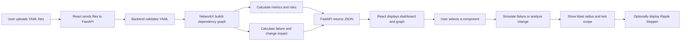
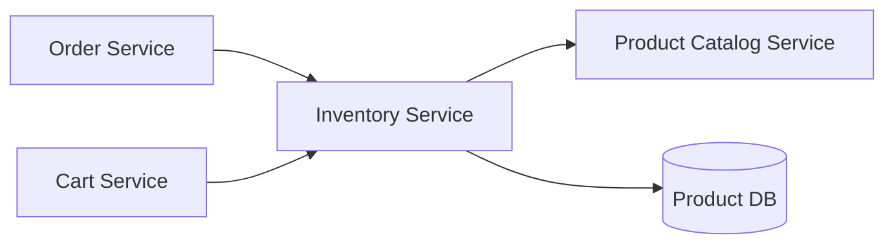
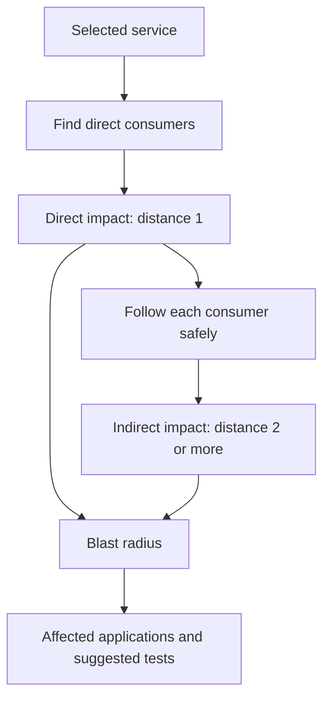
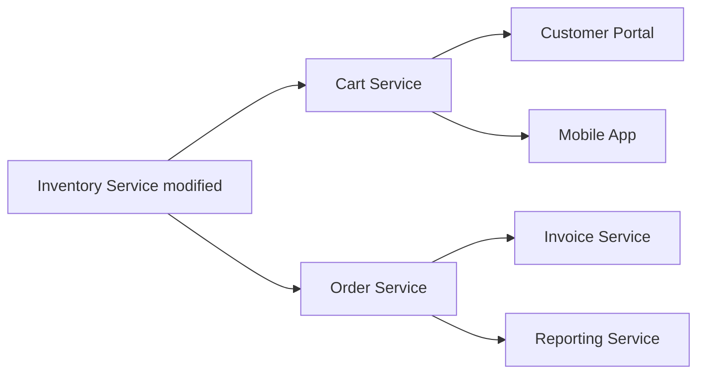
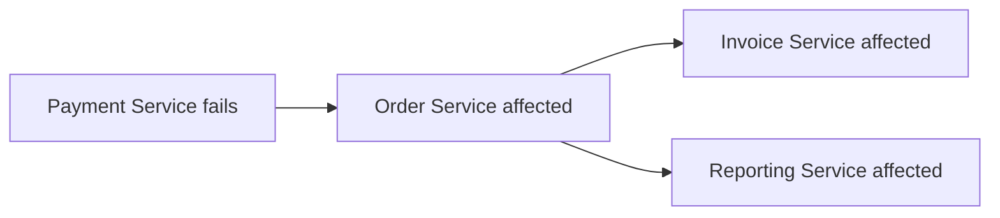
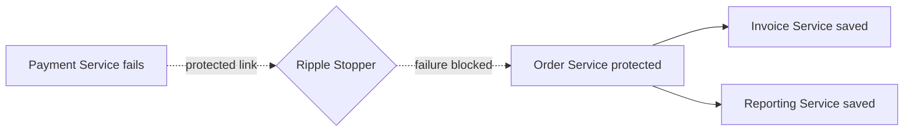
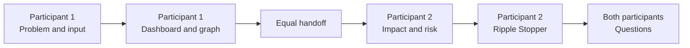

# RIP Hackathon Team Presentation Guide

This guide divides the presentation equally between two participants. It explains what each person should present, what to demonstrate, and how the complete application works.

## Team introduction

**Project:** RIP — Resilient Impact Platform  
**Problem:** API Dependency Visualizer and Change Impact Analyzer  
**Technology:** React JavaScript frontend, FastAPI Python backend, NetworkX graph analysis, and YAML input files

### One-line explanation

“RIP reads YAML dependency files, draws the system as a graph, and shows how a failure or change can affect connected services, applications, databases, and external systems.”

## Equal contribution plan

Both participants receive equal presentation time and equal technical responsibility.

| Participant | Main explanation responsibility | Demo responsibility | Suggested time |
|---|---|---|---:|
| Participant 1 | Problem, YAML input, React interface, dashboard, and dependency graph | Upload data, show metrics, search, and select a service | 5 minutes |
| Participant 2 | FastAPI, impact calculation, risk analysis, test scope, and Ripple Stopper | Run impact analysis, simulate failure, and deploy the stopper | 5 minutes |

Both participants should understand the complete application. The division above only decides who leads each part of the presentation.

## Complete application workflow



---

# Participant 1 — Input, Frontend, and Visualization

## 1. Explain the problem

Modern applications contain many connected services. If one service fails or changes, developers may not know which other systems will be affected.

RIP solves this problem by:

- Reading the provided YAML dependency files.
- Showing every component in an interactive graph.
- Allowing users to search and select a component.
- Showing important dashboard metrics.
- Sending failure and change requests to the backend.

## 2. Explain the YAML input

Each YAML file describes one service and its relationships.

Example:

```yaml
service: Inventory Service
type: API
dependencies:
  - Product Catalog Service
  - Product DB
consumers:
  - Cart Service
  - Order Service
```

Simple meaning:

- Inventory Service uses Product Catalog Service and Product DB.
- Cart Service and Order Service use Inventory Service.
- If Inventory Service changes, its consumers may be affected.

## 3. Explain the React frontend

The frontend is written in normal React JavaScript using `.jsx` and `.js` files.

| File | Simple purpose |
|---|---|
| `RipDashboard.jsx` | Controls the complete page and user actions. |
| `DatasetUploadPanel.jsx` | Lets the user choose and analyze YAML files. |
| `RequirementGraphViewer.jsx` | Draws the interactive dependency graph. |
| `ServiceDetailsPanel.jsx` | Shows information about the selected component. |
| `RiskAnalysisTable.jsx` | Displays components in risk order. |
| `dependencyAnalysisApi.js` | Connects React to the FastAPI backend. |
| `styles.css` | Provides the brown, yellow, and cream design. |

## 4. Explain the dashboard

The dashboard shows:

- Total services and APIs.
- Total applications.
- Total databases.
- Total external systems.
- Total components.
- Most connected service.
- Critical service candidate.
- Largest blast radius candidate.
- Architecture health score.

These values are calculated from the uploaded YAML files. They are not hard-coded in the React page.

## 5. Explain the graph



An arrow from **Order Service to Inventory Service** means that Order Service depends on Inventory Service.

Different colours help the user identify APIs, applications, databases, and external systems. The user can click a node to see its dependencies, consumers, risk, and impact.

## Participant 1 demo steps

1. Open the RIP application.
2. Upload only the official YAML dataset or click **Load Official Dataset**.
3. Click **Analyze Dataset**.
4. Explain the dashboard metrics.
5. Show the interactive dependency graph.
6. Use the component filters.
7. Search for **Inventory Service**.
8. Select Inventory Service and show its details.

## Handoff sentence

“The frontend makes the dependencies easy to understand. Now Participant 2 will explain how the backend calculates failure impact, change impact, risk, and protection.”

---

# Participant 2 — Backend, Impact Analysis, and Ripple Stopper

## 1. Explain the FastAPI backend

FastAPI receives the YAML files and performs the calculations.

| File | Simple purpose |
|---|---|
| `main.py` | Starts FastAPI and controls allowed frontend addresses. |
| `analysis_routes.py` | Provides the API endpoints used by React. |
| `dependency_file_parser.py` | Safely reads and validates YAML files. |
| `dependency_graph_builder.py` | Builds the directed NetworkX graph. |
| `failure_impact_analyzer.py` | Finds direct impact, indirect impact, and blast radius. |
| `risk_and_health_calculator.py` | Calculates risk and architecture health. |
| `architecture_analyzer.py` | Finds cycles, paths, depth, and connected components. |
| `test_plan_generator.py` | Suggests what should be tested first. |
| `ripple_stopper.py` | Tests how a protection layer reduces failure impact. |
| `test_dependency_analysis.py` | Verifies the important backend calculations. |

## 2. Explain failure and change impact



- **Direct impact** means components connected immediately to the selected service.
- **Indirect impact** means components reached through another affected component.
- **Blast radius** means the total number of affected components.
- The search safely handles dependency cycles without running forever.

## 3. Explain the Inventory Service example

When Inventory Service is modified, the required example is:



Expected result:

- Direct impact: Cart Service and Order Service.
- Indirect impact: Customer Portal, Mobile App, Invoice Service, and Reporting Service.
- Indirect impact count: 4.

The suggested tests include product availability, cart update, checkout, order placement, inventory stock changes, and reporting refresh.

## 4. Explain risk analysis

RIP gives each service a transparent risk score based on:

- 40% blast radius.
- 25% affected applications.
- 20% betweenness centrality.
- 15% dependency depth.

The backend also highlights possible single points of failure, dependency cycles, critical paths, and architecture health. These are engineering warnings that help teams decide where to investigate first.

## 5. Explain Ripple Stopper

Ripple Stopper is the innovation feature. It lets the user test a protection layer such as a queue, retry process, cache, circuit breaker, or backup route.

### Before protection



### After protection



The application recalculates the graph and immediately shows:

- The protected link.
- The original blast radius.
- The reduced blast radius.
- The systems saved by the stopper.

## Participant 2 demo steps

1. Use the already selected **Inventory Service**.
2. Click **Analyze Change**.
3. Show the two direct and four indirect impacts.
4. Explain the suggested test scope.
5. Select **Payment Service**.
6. Click **Simulate Failure**.
7. Explain the original blast radius.
8. Click **Deploy Stopper**.
9. Show the green protected link and systems saved.
10. Finish with the risk table and architecture health score.

---

# Shared Demo Timeline



| Time | Speaker | Topic |
|---:|---|---|
| 0:00–1:00 | Participant 1 | Problem and solution introduction |
| 1:00–2:30 | Participant 1 | YAML input and system workflow |
| 2:30–5:00 | Participant 1 | React dashboard, search, and graph demo |
| 5:00–6:30 | Participant 2 | FastAPI and graph calculations |
| 6:30–8:00 | Participant 2 | Inventory change-impact demo |
| 8:00–10:00 | Participant 2 | Payment failure and Ripple Stopper demo |
| Questions | Both | Answer based on each participant's area, then support each other |

# Important panel questions

## Why use YAML?

YAML is easy for engineering teams to read and maintain. The hackathon also provides dependency information in YAML format.

## Why use NetworkX?

NetworkX provides reliable graph operations for finding paths, cycles, centrality, and affected downstream components.

## Is the output generated by AI?

No. The important impact and risk results are deterministic graph calculations. The same input always produces the same result.

## How do you prevent an infinite loop?

The graph traversal keeps a visited set. A component is processed only once, even if the data contains a cycle.

## What is innovative about RIP?

Most dependency tools only show how a failure spreads. Ripple Stopper also lets users test a protection layer and see the reduced impact immediately.

## Does the application use only the supplied dataset?

Yes. The official demo loads the supplied YAML definitions and the required Inventory Service change scenario. Extra example datasets are not mixed into that analysis.

## How was the application tested?

The backend has automated tests for YAML validation, graph direction, impact analysis, the official Inventory Service result, and Ripple Stopper. The frontend is also verified with a production build.

# Final closing statement

“RIP converts simple architecture files into useful engineering decisions. It shows what is connected, what will be affected, what should be tested, and how a protection layer can reduce the impact before a real outage occurs.”
